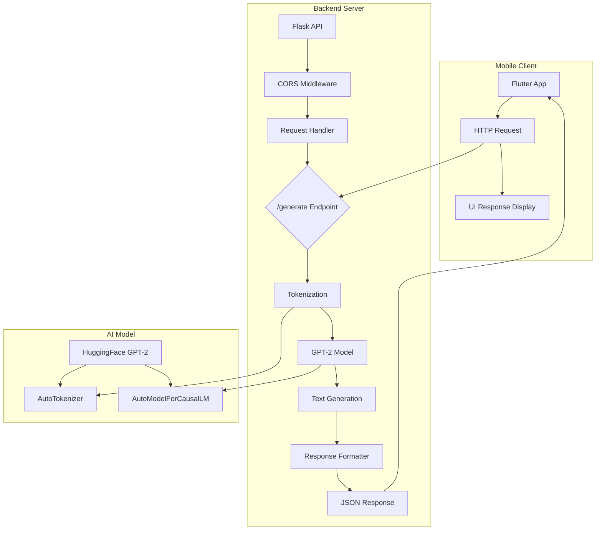

# 🤖 LLM API Server with Flutter Client

<div align="center">


**A complete LLM-powered application with Flask API backend and Flutter mobile frontend**

[🚀 API Documentation](#api-documentation) • [📱 Mobile App](#flutter-client) • [🧪 Examples](#example-usage) • [💡 Contributing](#contributing)

</div>

## 📋 Table of Contents

- [✨ Overview](#-overview)
- [🏗️ Architecture](#️-architecture)
- [🚀 Quick Start](#-quick-start)
- [🔧 Installation](#-installation)
- [⚙️ API Reference](#️-api-reference)
- [📱 Flutter Client](#-flutter-client)
- [🧪 Example Usage](#-example-usage)
- [🔍 Testing](#-testing)
- [🔮 Future Improvements](#-future-improvements)
- [🤝 Contributing](#-contributing)
- [📄 License](#-license)

## ✨ Overview

This project is a full-stack implementation of a Large Language Model (LLM) application featuring:

- **Flask Backend API**: RESTful API server with GPT-2 model integration
- **Flutter Mobile Frontend**: Cross-platform mobile application for text generation
- **CORS Support**: Secure cross-origin resource sharing
- **Error Handling**: Comprehensive error management and logging
- **Scalable Architecture**: Modular design for easy extension

## 🏗️ Architecture



## 🚀 Quick Start

### Prerequisites
- **Python 3.8+** for backend
- **Flutter 3.0+** for mobile app
- **pip** and **pub** package managers
- **Git** for version control

### Installation in 5 Minutes

1. **Clone the repository**
```bash
git clone https://github.com/Adeel78688/llm-Chatbot-Application.git
cd llm-flask-flutter
```

2. **Set up the backend**
```bash
# Navigate to backend directory
cd backend

# Create virtual environment
python -m venv venv

# Activate virtual environment
# On Windows
venv\Scripts\activate
# On macOS/Linux
source venv/bin/activate

# Install dependencies
pip install -r requirements.txt
```

3. **Set up the mobile app**
```bash
# Navigate to mobile directory
cd ../mobile

# Install Flutter dependencies
flutter pub get
```

4. **Run both applications**
```bash
# Terminal 1: Start Flask server
cd backend
python app.py

# Terminal 2: Start Flutter app
cd mobile
flutter run
```

## 🔧 Detailed Installation

### Backend Setup

#### 1. Environment Setup
```bash
# Clone repository
git clone https://github.com/Adeel78688/llm-Chatbot-Application.git
cd llm-Chatbot-Application/backend

# Create and activate virtual environment
python -m venv venv
source venv/bin/activate  # Windows: venv\Scripts\activate

# Upgrade pip
python -m pip install --upgrade pip
```

#### 2. Install Dependencies
```bash
# Install from requirements.txt
pip install -r requirements.txt

# Or install manually
pip install flask flask-cors transformers torch
```

#### 3. Verify Installation
```bash
# Check Python version
python --version  # Should be 3.8+

# Check installed packages
pip list | grep -E "(flask|transformers|torch)"

# Test server
python app.py
# Server should start at http://0.0.0.0:5000
```

### Mobile App Setup

#### 1. Flutter Environment
```bash
# Install Flutter (if not installed)
# Follow: https://flutter.dev/docs/get-started/install

# Verify Flutter installation
flutter doctor

# Navigate to mobile directory
cd llm-flask-flutter/mobile
```

#### 2. Install Dependencies
```bash
# Get Flutter packages
flutter pub get

# Verify dependencies
flutter packages get
```

#### 3. Platform Setup
```bash
# For Android
flutter doctor --android-licenses

# For iOS (macOS only)
cd ios
pod install
cd ..
```

## ⚙️ API Reference

### Base URL
```
http://localhost:5000
```

### Endpoints

#### POST `/generate`
Generate text using GPT-2 model.

**Request Body:**
```json
{
  "prompt": "Once upon a time",
  "max_length": 100
}
```

**Parameters:**
| Parameter | Type | Required | Default | Description |
|-----------|------|----------|---------|-------------|
| `prompt` | string | Yes | - | Input text for generation |
| `max_length` | integer | No | 50 | Max tokens in response (max: 200) |

**Success Response:**
```json
{
  "response": "Once upon a time, there was a magical kingdom where..."
}
```

**Error Response:**
```json
{
  "error": "Error message details"
}
```

**Status Codes:**
- `200`: Success
- `400`: Bad request
- `500`: Internal server error

### Example API Calls

#### Using cURL
```bash
curl -X POST http://localhost:5000/generate \
  -H "Content-Type: application/json" \
  -d '{"prompt": "The future of AI is", "max_length": 75}'
```

#### Using Python
```python
import requests

response = requests.post(
    "http://localhost:5000/generate",
    json={
        "prompt": "Artificial intelligence will",
        "max_length": 100
    }
)
print(response.json())
```

#### Using JavaScript
```javascript
fetch('http://localhost:5000/generate', {
    method: 'POST',
    headers: {
        'Content-Type': 'application/json',
    },
    body: JSON.stringify({
        prompt: 'Hello world',
        max_length: 50
    })
})
.then(response => response.json())
.then(data => console.log(data));
```

## 📱 Flutter Client

### App Structure
```
mobile/
├── lib/
│   ├── main.dart          # Main application file
│   ├── api_service.dart   # API communication layer
│   └── models/            # Data models
├── pubspec.yaml           # Dependencies
├── android/               # Android-specific files
├── ios/                   # iOS-specific files
└── test/                  # Test files
```

### Key Components

#### 1. API Service
```dart
class ApiService {
  static const String baseUrl = 'http://127.0.0.1:5000';
  
  static Future<String> generateText(String prompt, int maxLength) async {
    try {
      final response = await http.post(
        Uri.parse('$baseUrl/generate'),
        headers: {'Content-Type': 'application/json'},
        body: jsonEncode({
          'prompt': prompt,
          'max_length': maxLength,
        }),
      );
      
      if (response.statusCode == 200) {
        final data = jsonDecode(response.body);
        return data['response'];
      } else {
        throw Exception('Failed to generate text: ${response.statusCode}');
      }
    } catch (e) {
      throw Exception('Network error: $e');
    }
  }
}
```

#### 2. UI Features
- **Material Design**: Modern Flutter UI components
- **Responsive Layout**: Adapts to different screen sizes
- **Loading States**: Visual feedback during API calls
- **Error Handling**: User-friendly error messages
- **Text Input**: Customizable prompt entry

### Building for Different Platforms

#### Android APK
```bash
# Debug build
flutter build apk --debug

# Release build
flutter build apk --release

# Split per ABI
flutter build apk --split-per-abi
```

#### iOS App
```bash
# Build for simulator
flutter build ios --simulator

# Build for device
flutter build ios
```

#### Web Deployment
```bash
# Build for web
flutter build web

# Serve locally
flutter run -d chrome
```

## 🧪 Example Usage

### Basic Text Generation

**Input:**
```
"The benefits of exercise are"
```

**Output:**
```
"The benefits of exercise are numerous and well-documented. Regular physical activity improves cardiovascular health, boosts mood, increases energy levels, and helps maintain a healthy weight. It also reduces the risk of chronic diseases..."
```

### Creative Writing

**Input:**
```
"In a distant galaxy, there was a planet made entirely of crystals. The inhabitants"
```

**Output:**
```
"In a distant galaxy, there was a planet made entirely of crystals. The inhabitants, known as the Lumina, communicated through light patterns that reflected off their crystalline structures. Their society was built on principles of harmony and reflection..."
```

### Code Generation

**Input:**
```
"Write a Python function to calculate factorial:"
```

**Output:**
```
"def factorial(n):
    if n == 0 or n == 1:
        return 1
    else:
        return n * factorial(n-1)"
```

## 🔍 Testing

### Backend Testing

#### Unit Tests
```bash
# Install test dependencies
pip install pytest pytest-cov

# Run tests
pytest tests/ -v

# With coverage
pytest --cov=app tests/
```

#### API Testing with Postman
1. Import the Postman collection from `/docs/postman_collection.json`
2. Set environment variables
3. Run test suite

#### Load Testing
```bash
# Install locust
pip install locust

# Run load test
locust -f tests/load_test.py
```

### Mobile App Testing

#### Unit Tests
```bash
# Run Flutter tests
flutter test

# Run specific test file
flutter test test/api_service_test.dart
```

#### Widget Tests
```bash
# Test widgets
flutter test test/widget_test.dart
```

#### Integration Tests
```bash
# Run integration tests
flutter test integration_test/app_test.dart
```

## 🔮 Future Improvements

### 🚀 **Phase 1: Enhanced Features** (Next 1 Month)
- [ ] **Model Improvements**
  - [ ] Support for GPT-2-medium and GPT-2-large
  - [ ] Model caching for faster responses
  - [ ] Quantization for reduced memory usage
  - [ ] Support for other models (BERT, T5, etc.)

- [ ] **API Enhancements**
  - [ ] Rate limiting and request throttling
  - [ ] API key authentication
  - [ ] Request logging and monitoring
  - [ ] Swagger/OpenAPI documentation

- [ ] **Mobile App Features**
  - [ ] Text-to-speech output
  - [ ] Conversation history
  - [ ] Favorite prompts saving
  - [ ] Dark/light theme support

### 📈 **Phase 2: Advanced Capabilities** (1-3 Months)
- [ ] **Multi-Model Support**
  - [ ] Model selection dropdown
  - [ ] Comparative text generation
  - [ ] Ensemble model responses
  - [ ] Fine-tuning capabilities

- [ ] **Enhanced UI/UX**
  - [ ] Real-time streaming responses
  - [ ] Markdown rendering support
  - [ ] Code syntax highlighting
  - [ ] Export options (PDF, TXT, DOC)

- [ ] **Deployment Features**
  - [ ] Docker containerization
  - [ ] Kubernetes deployment
  - [ ] Cloud deployment scripts (AWS, GCP, Azure)
  - [ ] CI/CD pipeline setup

### 🌐 **Phase 3: Enterprise Features** (3-6 Months)
- [ ] **Scalability**
  - [ ] Load balancing support
  - [ ] Database integration for history
  - [ ] Redis caching layer
  - [ ] Async processing with Celery

- [ ] **Security**
  - [ ] JWT authentication
  - [ ] HTTPS enforcement
  - [ ] Input sanitization
  - [ ] Content filtering

- [ ] **Analytics**
  - [ ] Usage analytics dashboard
  - [ ] Performance monitoring
  - [ ] Cost tracking for API calls
  - [ ] User behavior insights

### 🎯 **Phase 4: Specialized Features** (6+ Months)
- [ ] **Domain-Specific Models**
  - [ ] Medical text generation
  - [ ] Legal document assistance
  - [ ] Technical documentation
  - [ ] Creative writing enhancement

- [ ] **Multi-modal Support**
  - [ ] Image caption generation
  - [ ] Document analysis
  - [ ] Voice input support
  - [ ] Multi-language processing

- [ ] **Collaboration Features**
  - [ ] Shared workspace
  - [ ] Team collaboration tools
  - [ ] Version control for generated content
  - [ ] Approval workflows

## 🛠️ Development Guide

### Adding New Features

#### 1. Adding a New API Endpoint
```python
@app.route('/analyze', methods=['POST'])
def analyze_text():
    data = request.json
    text = data.get('text', '')
    
    # Add your analysis logic here
    analysis = {
        'sentiment': 'positive',
        'length': len(text),
        'tokens': len(text.split())
    }
    
    return jsonify(analysis)
```

#### 2. Adding Mobile App Features
```dart
// Add new feature in Flutter
class NewFeaturePage extends StatelessWidget {
  @override
  Widget build(BuildContext context) {
    return Scaffold(
      appBar: AppBar(title: Text('New Feature')),
      body: Center(child: Text('Implement your feature here')),
    );
  }
}
```

### Code Style Guidelines

#### Python Backend
```python
# Follow PEP 8
# Use type hints
# Add docstrings
# Keep functions small and focused
```

#### Flutter Frontend
```dart
// Follow Dart style guide
// Use const constructors
// Implement proper error handling
// Add comments for complex logic
```

### Performance Optimization

#### Backend Optimizations
```python
# Implement response caching
from flask_caching import Cache

cache = Cache(config={'CACHE_TYPE': 'simple'})
cache.init_app(app)

@app.route('/generate')
@cache.cached(timeout=300)
def generate_text():
    # Cached for 5 minutes
    pass
```

#### Mobile Optimizations
```dart
// Use FutureBuilder for async operations
FutureBuilder<String>(
  future: ApiService.generateText(prompt),
  builder: (context, snapshot) {
    if (snapshot.connectionState == ConnectionState.waiting) {
      return CircularProgressIndicator();
    }
    if (snapshot.hasError) {
      return Text('Error: ${snapshot.error}');
    }
    return Text(snapshot.data ?? '');
  },
)
```

## 🤝 Contributing

We welcome contributions from the community! Here's how you can help:

### Ways to Contribute
1. **Report Bugs** - Open an issue with detailed bug reports
2. **Suggest Features** - Share your ideas for improvement
3. **Submit Pull Requests** - Fix bugs or add features
4. **Improve Documentation** - Help others understand the project
5. **Share Examples** - Create tutorials or usage examples

### Contribution Process
1. **Fork** the repository
2. **Create** a feature branch: `git checkout -b feature/amazing-feature`
3. **Commit** your changes: `git commit -m 'Add amazing feature'`
4. **Push** to the branch: `git push origin feature/amazing-feature`
5. **Open** a Pull Request

### Development Setup for Contributors
```bash
# 1. Fork and clone
git clone https://github.com/Adeel78688/llm-Chatbot-Application.git
cd llm-chatbot-Application

# 2. Set up development environment
cd backend
python -m venv venv
source venv/bin/activate
pip install -r requirements-dev.txt

# 3. Run tests
pytest

# 4. Make your changes and test
# 5. Submit PR
```

## 📄 License

This project is licensed under the MIT License - see the [LICENSE](LICENSE) file for details.

## 🙏 Acknowledgments

- **Hugging Face** for the transformers library and pre-trained models
- **Flask Team** for the lightweight web framework
- **Flutter Team** for the amazing cross-platform framework
- **Contributors** who help improve this project

## 📞 Support

### Getting Help
- **Documentation**: Check the [Wiki](https://github.com/Adeel78688/llm-chatbot-Application/wiki)
- **Issues**: [GitHub Issues](https://github.com/Adeel78688/llm-Chatbot-Application/issues)
- **Discussions**: [GitHub Discussions](https://github.com/Adeel78688/llm-Chatbot-Application/discussions)
- **Email**: adeelchoudary78688@gmail.com

### Community
- Join our [Discord Server](https://discord.gg/your-invite-link)
- Follow on [Twitter](https://twitter.com/your-project)
- Read our [Blog](https://blog.llm-Chatbot-Application.com)

---

<div align="center">

## 🌟 Show Your Support

If you find this project useful, please give it a star! ⭐

[](https://star-history.com/#Adeel78688/llm-Chatbot-Application&Date)

### Built with ❤️ by the Open Source Community

**Happy Coding! 🚀**

</div>


